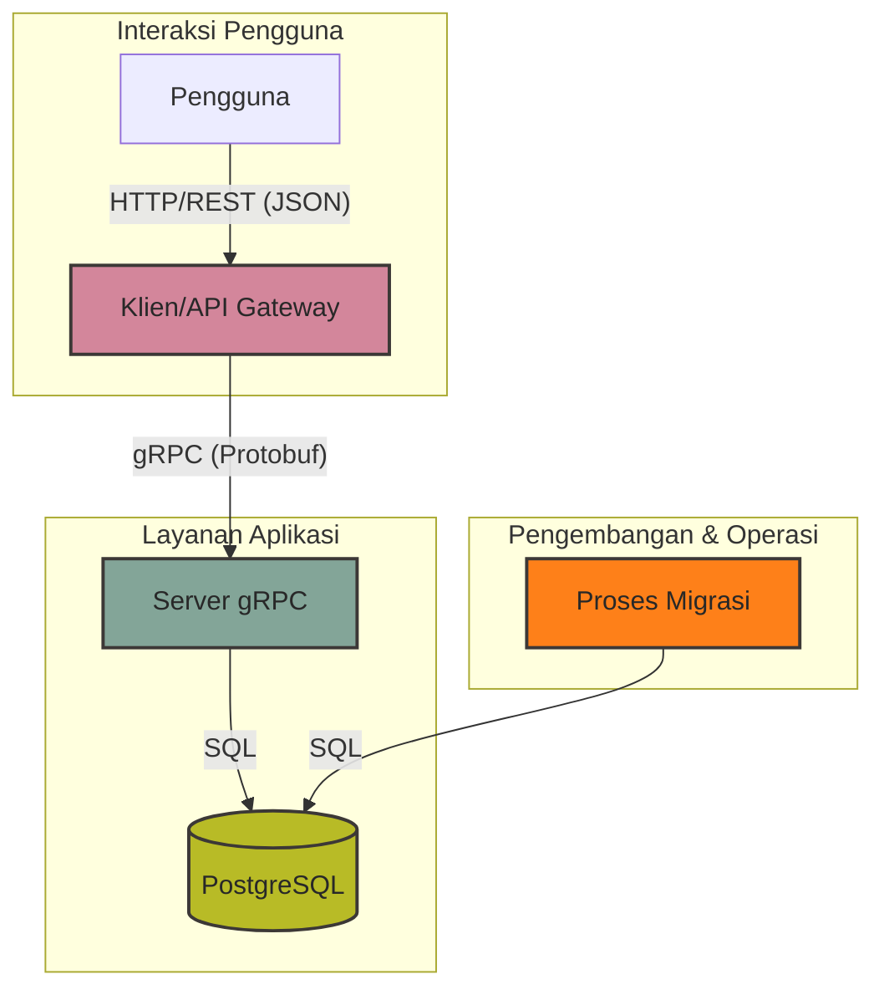
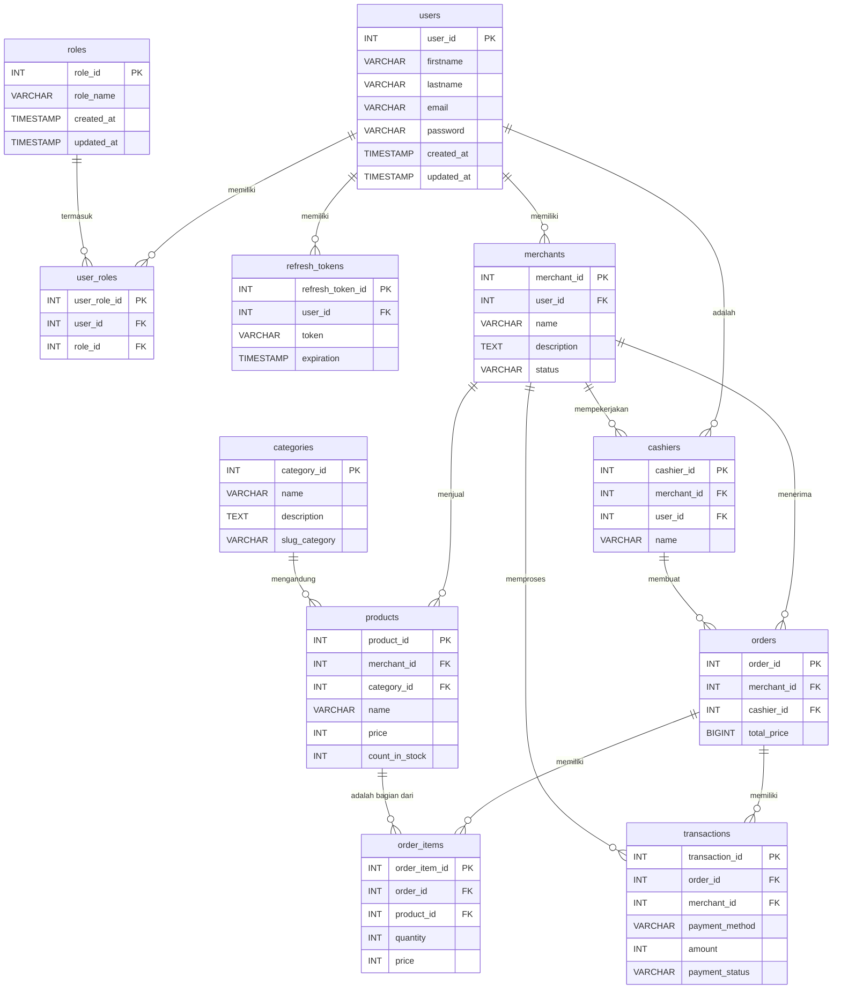

# 💳 Proyek Point of Sale (POS) gRPC

Proyek ini merupakan **implementasi backend untuk sistem Point of Sale (POS)** yang dirancang dengan arsitektur **monolitik terstruktur**. Meskipun monolitik, proyek ini disusun dengan modul-modul yang jelas sehingga setiap domain (misalnya pengguna, merchant, inventaris, dan transaksi) tetap mudah dikelola serta memungkinkan pengembangan lebih lanjut tanpa kehilangan keteraturan.

Tujuan utama dari proyek ini adalah untuk menghadirkan **fondasi kuat, aman, dan skalabel** bagi aplikasi kasir modern yang digunakan oleh berbagai jenis bisnis ritel. Dengan desain yang terstruktur, sistem mampu menangani kebutuhan kasir sehari-hari mulai dari pengelolaan pengguna, inventaris, hingga pencatatan transaksi penjualan, sambil tetap mudah di-deploy di berbagai lingkungan.

Komunikasi antara klien dengan server dilakukan melalui **REST API**, sementara komunikasi internal antara API Gateway dan layanan utama menggunakan **gRPC** dengan **Protobuf**. Hal ini memastikan sistem memiliki **latensi rendah dan throughput tinggi**, sehingga tetap responsif meskipun menangani transaksi dalam jumlah besar. Data transaksi dan manajemen entitas disimpan dengan aman di dalam **PostgreSQL**, yang dikenal stabil dan handal untuk kebutuhan finansial serta operasional.

### Lingkup dan Fungsi Utama

* **🔐 Manajemen Pengguna & Peran**
  Sistem mendukung otentikasi dan otorisasi dengan level akses berbeda (admin, pemilik merchant, kasir). Hal ini memastikan hanya pihak berwenang yang dapat melakukan aksi tertentu sesuai tanggung jawabnya.

* **🏬 Manajemen Merchant**
  Pemilik bisnis dapat mendaftarkan toko/merchant, mengatur informasi penting seperti nama toko, API key, hingga struktur operasional yang mereka miliki.

* **👨‍💼 Manajemen Kasir**
  Merchant dapat menambahkan akun kasir, memberikan akses sesuai kebutuhan, serta memantau aktivitas kasir mereka secara langsung.

* **📦 Manajemen Inventaris**
  Mendukung CRUD penuh terhadap produk dan kategori, mencakup detail stok, harga, deskripsi, hingga kategori produk. Dengan sistem ini, stok selalu up-to-date dan bisa dikontrol secara efisien.

* **💳 Proses Transaksi**
  Sistem menyediakan alur lengkap untuk membuat pesanan, menambahkan item ke keranjang, menghitung total pembayaran, hingga mencatat transaksi secara permanen di database.

* **⚡ Komunikasi gRPC Internal**
  API Gateway berkomunikasi dengan server utama melalui gRPC, yang memberikan performa tinggi serta mempermudah scaling di masa depan jika sistem ingin dipecah menjadi microservices.

* **📖 Dokumentasi API Otomatis**
  REST API secara otomatis terdokumentasi dengan Swagger (**Swago**), sehingga memudahkan developer maupun tim integrasi untuk memahami dan menguji endpoint yang tersedia.

* **🐳 Kontainerisasi dengan Docker**
  Sistem siap dijalankan pada lingkungan terisolasi dengan Docker & Docker Compose, membuat proses setup menjadi cepat, konsisten, dan mudah di-deploy di berbagai platform.

---

## 🧰 Tech Teknologi

- 🐹 **Go (Golang)** — Bahasa implementasi.
- 🌐 **Echo** — Kerangka kerja web minimalis untuk membangun REST API.
- 🪵 **Zap Logger** — Pencatatan terstruktur untuk aplikasi berkinerja tinggi.
- 📦 **SQLC** — Menghasilkan kode Go yang aman dari tipe dari kueri SQL.
- 🚀 **gRPC** — RPC berkinerja tinggi untuk komunikasi layanan internal.
- 🧳 **Goose** — Alat migrasi untuk mengelola perubahan skema database.
- 🐳 **Docker** — Platform kontainerisasi untuk lingkungan pengembangan yang konsisten.
- 📄 **Swago** — Menghasilkan dokumentasi Swagger 2.0 untuk rute Echo.
- 🔗 **Docker Compose** — Mengelola aplikasi Docker multi-kontainer.

---


## Arsitektur
Aplikasi ini dirancang dengan arsitektur berorientasi layanan monolith (monolith). REST API yang menghadap klien bertindak sebagai gateway, menerjemahkan permintaan HTTP menjadi panggilan gRPC ke server backend. Server ini berisi logika bisnis inti dan berkomunikasi dengan database PostgreSQL.



## 🗃️ Diagram ERD (Entity-Relationship Diagram)

Diagram ini menunjukkan struktur dan hubungan antar tabel dalam database.



---

## 🚀 Panduan Menjalankan Proyek

Ikuti langkah-langkah ini untuk menjalankan proyek di lingkungan lokal Anda.

### 1. Prasyarat

- [Go](https://golang.org/doc/install) (versi 1.20+)
- [Docker](https://www.docker.com/get-started) dan [Docker Compose](https://docs.docker.com/compose/install/)
- [Make](https://www.gnu.org/software/make/)
- [Git](https://git-scm.com/downloads)

### 2. Klon Repositori

```bash
git clone https://github.com/your-username/point-of-sale-grpc.git
cd point-of-sale-grpc
```

### 3. Konfigurasi Lingkungan

Salin file `.env.example` menjadi `.env` untuk konfigurasi lokal dan `docker.env.example` menjadi `docker.env` untuk konfigurasi Docker.

```bash
cp .env.example .env
cp docker.env.example docker.env
```

Sesuaikan variabel di dalam file `.env` dan `docker.env` sesuai dengan pengaturan lokal Anda (misalnya, kredensial database).

### 4. Menjalankan dengan Docker (Direkomendasikan)

Ini adalah cara termudah untuk memulai.

```bash
make docker-up
```

Perintah ini akan:
1. Membangun image Docker untuk `server`, `client`, dan `migrate`.
2. Menjalankan database PostgreSQL.
3. Menjalankan migrasi database secara otomatis.
4. Menjalankan `server` gRPC dan `client` REST API.

Untuk menghentikan semua layanan, jalankan:
```bash
make docker-down
```

### 5. Menjalankan Secara Lokal

Jika Anda tidak ingin menggunakan Docker, ikuti langkah-langkah berikut:

**a. Jalankan Database**
Pastikan Anda memiliki instance PostgreSQL yang berjalan secara lokal dan konfigurasikan koneksi di file `.env`.

**b. Lakukan Migrasi Database**
```bash
make migrate
```

**c. Hasilkan Kode Protobuf**
Jika Anda mengubah file `.proto`, jalankan perintah ini:
```bash
make generate-proto
```

**d. Jalankan Server gRPC**
```bash
make run-server
```
Server akan berjalan di port yang ditentukan di `.env` (default: `50051`).

**e. Jalankan Client (REST API)**
Buka terminal baru dan jalankan:
```bash
make run-client
```
Client REST API akan berjalan di port yang ditentukan di `.env` (default: `5000`).

---

## 📚 Dokumentasi API

Setelah menjalankan `client`, dokumentasi API Swagger akan tersedia di:

[http://localhost:5000/swagger/index.html](http://localhost:5000/swagger/index.html)
