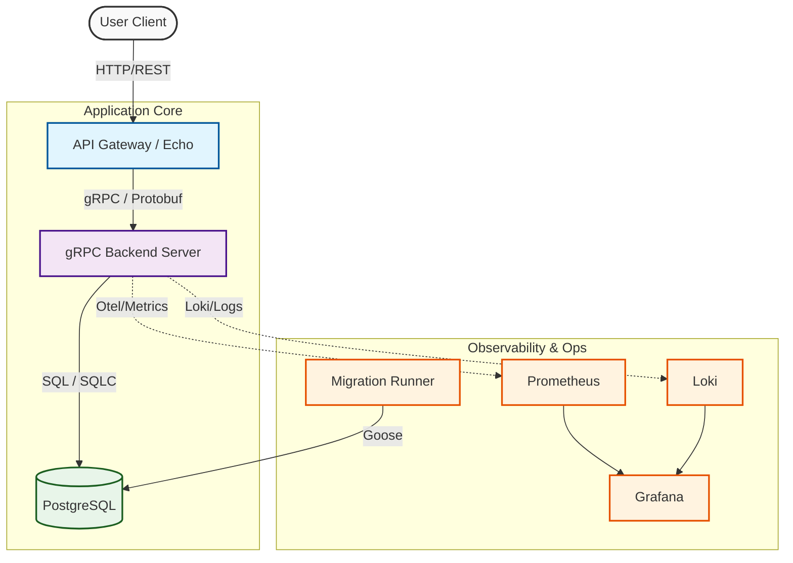
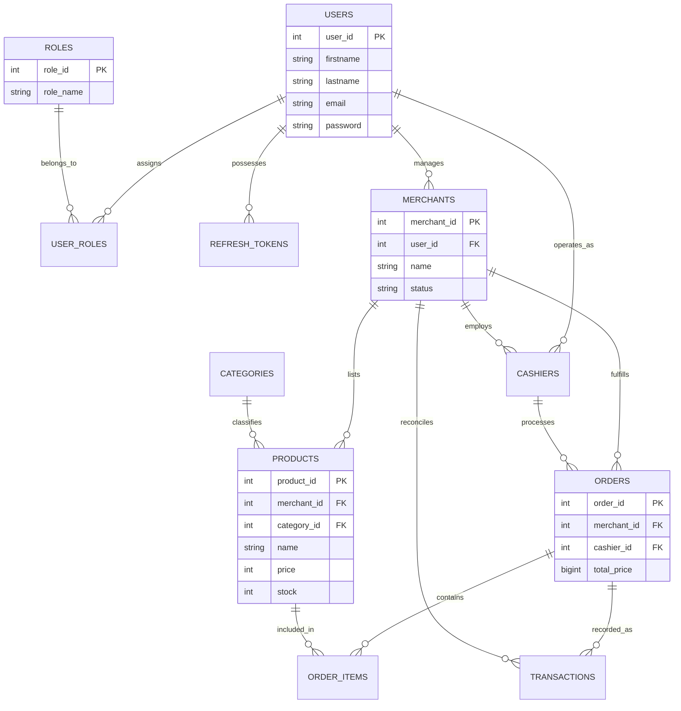

# Point of Sale (POS) System

This repository contains a structured monolithic backend implementation for a modern Point of Sale (POS) system. Designed for high performance and scalability, the architecture leverages gRPC for internal communication and a RESTful API gateway for client interactions.

The system provides a robust foundation for retail operations, managing complex workflows including user authorization, merchant management, inventory control, and transaction processing.

---

## Architectural Overview

The system utilizes a structured monolith pattern where domain logic is clearly decoupled into manageable modules. This design ensures maintainability while providing a clear path toward microservices if required by organizational growth.

### Technical Stack

- **Primary Language**: Go (Golang)
- **Web Framework**: Echo (REST API Gateway)
- **Communication Layer**: gRPC with Protocol Buffers (Internal RPC)
- **Database Architecture**: PostgreSQL
- **Query Generation**: SQLC (Type-safe SQL)
- **Schema Management**: Goose (Database Migrations)
- **Observability Stack**: OpenTelemetry, Prometheus, Grafana, Loki
- **Containerization**: Docker & Docker Compose
- **API Documentation**: Swagger (via Swago)

### System Architecture Diagram


```mermaid
graph TD
    classDef external fill:#f9f9f9,stroke:#333,stroke-width:2px;
    classDef gateway fill:#e1f5fe,stroke:#01579b,stroke-width:2px;
    classDef service fill:#f3e5f5,stroke:#4a148c,stroke-width:2px;
    classDef storage fill:#e8f5e9,stroke:#1b5e20,stroke-width:2px;
    classDef ops fill:#fff3e0,stroke:#e65100,stroke-width:2px;

    User([User Client]) --> |HTTP/REST| API[API Gateway / Echo]
    
    subgraph "Application Core"
        API --> |gRPC / Protobuf| GRPC[gRPC Backend Server]
        GRPC --> |SQL / SQLC| DB[(PostgreSQL)]
    end

    subgraph "Observability & Ops"
        GRPC -.-> |Otel/Metrics| PROM[Prometheus]
        GRPC -.-> |Loki/Logs| LOKI[Loki]
        PROM --> GRAF[Grafana]
        LOKI --> GRAF
        MIG[Migration Runner] --> |Goose| DB
    end

    class User external;
    class API gateway;
    class GRPC service;
    class DB storage;
    class PROM,LOKI,GRAF,MIG ops;
```

---

## Domain Capabilities

- **Identity & Access Management (IAM)**: Sophisticated RBAC (Role-Based Access Control) supporting multiple tiers including Administrators, Merchant Owners, and Cashiers.
- **Merchant Ecosystem**: Centralized management for business entities, including operational configuration and API authentication.
- **Inventory Lifecycle**: Comprehensive CRUD operations for products and categories, featuring real-time stock tracking and pricing management.
- **Transactional Engine**: End-to-end sales workflow encompassing order initiation, line-item management, and permanent transaction recording.
- **High-Performance RPC**: Optimized internal service communication using gRPC, ensuring low latency and high throughput for high-concurrency environments.

---

## Database Architecture

The following Entity-Relationship Diagram (ERD) outlines the normalized database schema designed for consistency and referential integrity.


```mermaid
erDiagram
    USERS ||--o{ USER_ROLES : "assigns"
    ROLES ||--o{ USER_ROLES : "belongs_to"
    USERS ||--o{ REFRESH_TOKENS : "possesses"
    USERS ||--o{ MERCHANTS : "manages"
    USERS ||--o{ CASHIERS : "operates_as"
    MERCHANTS ||--o{ CASHIERS : "employs"
    MERCHANTS ||--o{ PRODUCTS : "lists"
    CATEGORIES ||--o{ PRODUCTS : "classifies"
    MERCHANTS ||--o{ ORDERS : "fulfills"
    CASHIERS ||--o{ ORDERS : "processes"
    ORDERS ||--o{ ORDER_ITEMS : "contains"
    PRODUCTS ||--o{ ORDER_ITEMS : "included_in"
    ORDERS ||--o{ TRANSACTIONS : "recorded_as"
    MERCHANTS ||--o{ TRANSACTIONS : "reconciles"

    USERS {
        int user_id PK
        string firstname
        string lastname
        string email
        string password
    }
    ROLES {
        int role_id PK
        string role_name
    }
    MERCHANTS {
        int merchant_id PK
        int user_id FK
        string name
        string status
    }
    PRODUCTS {
        int product_id PK
        int merchant_id FK
        int category_id FK
        string name
        int price
        int stock
    }
    ORDERS {
        int order_id PK
        int merchant_id FK
        int cashier_id FK
        bigint total_price
    }
```

---

## Getting Started

### Prerequisites

- **Go**: Version 1.20 or higher
- **Containerization**: Docker and Docker Compose
- **Build Tooling**: GNU Make
- **Version Control**: Git

### Installation

1. **Clone the repository**:
   ```bash
   git clone https://github.com/MamangRust/point-of-sale-grpc.git
   cd point-of-sale-grpc
   ```

2. **Environment Configuration**:
   Provision your local environment variables:
   ```bash
   cp .env.example .env
   cp docker.env.example docker.env
   ```
   *Note: Ensure the database credentials in `.env` match your local or Docker configuration.*

### Deployment with Docker (Recommended)

The most efficient way to orchestrate the entire stack:

```bash
just docker-up
```

This command automates the following processes:
- Build and initialization of `server`, `client`, and `migration` containers.
- Deployment of a PostgreSQL instance.
- Automatic execution of database migrations.
- Bootstrapping of the gRPC backend and REST API Gateway.

To terminate the services:
```bash
just docker-down
```

### Manual Local Execution

If running outside of Docker:

1. **Database Migration**:
   ```bash
   just migrate
   ```

2. **Code Generation** (Optional, if `.proto` files are modified):
   ```bash
   just generate-proto
   ```

3. **Backend Server (gRPC)**:
   ```bash
   just run-server
   ```
   *Default Port: 50051*

4. **API Gateway (REST)**:
   ```bash
   just run-client
   ```
   *Default Port: 5000*

---

## Observability & Documentation

### API Reference
Once the API Gateway is operational, comprehensive interactive documentation is available via Swagger:
- **URL**: [http://localhost:5000/swagger/index.html](http://localhost:5000/swagger/index.html)

### Monitoring
The system includes a pre-configured observability stack accessible via Grafana. This allows for real-time monitoring of service health, performance metrics, and log aggregation.
- **Grafana URL**: [http://localhost:3000](http://localhost:3000) (default credentials usually apply)

---

## Testing Framework

The project maintains high reliability through multiple testing layers:

- **Integration Testing**: Orchestrated via [Hurl](https://hurl.dev/) for end-to-end API validation.
- **Performance Benchmarking**: Stress and load testing implemented with [k6](https://k6.io/).
- **Unit & Feature Testing**: Standard Go testing suite located in the `/tests` directory.

To execute the test suite:
```bash
just test-all
```
