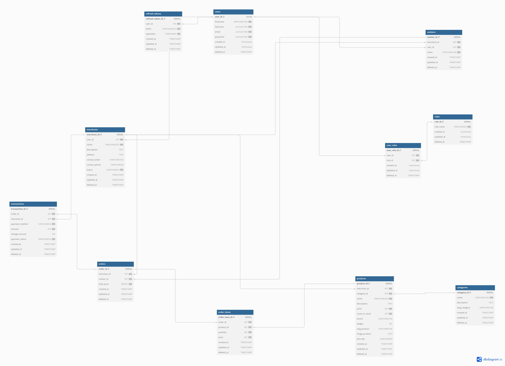

## Point of sale

### Overview

A modern Point of Sale (POS) system built with:

- Backend: Go (Golang) with Echo framework

- Database: PostgreSQL with SQLC for type-safe SQL queries

- API Architecture: gRPC for internal services communication

- Authentication: JWT with refresh tokens

### Features
Core Functionality

- 🛒 Product Management - Create, read, update, and delete products

- 🏷️ Category Management - Organize products into categories

- 🏪 Merchant Management - Manage multiple merchant accounts

- 💳 Order Processing - Create and manage customer orders

- 💰 Transaction Handling - Process payments and track transactions

- 👥 User Roles - Role-based access control (RBAC)

### Database Schema

The system uses PostgreSQL with the following main tables:

- Users & Authentication: users, roles, user_roles, refresh_tokens

- Merchant Management: merchants, cashiers

- Product Catalog: categories, products

- Order Processing: orders, order_items, transactions

### ERD

### Swagger

